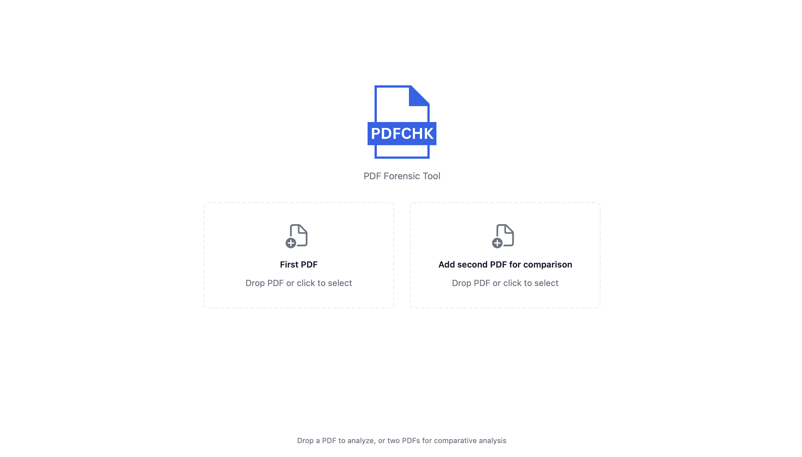
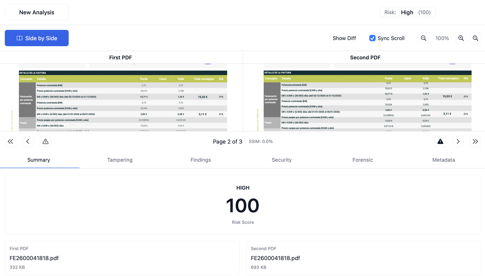
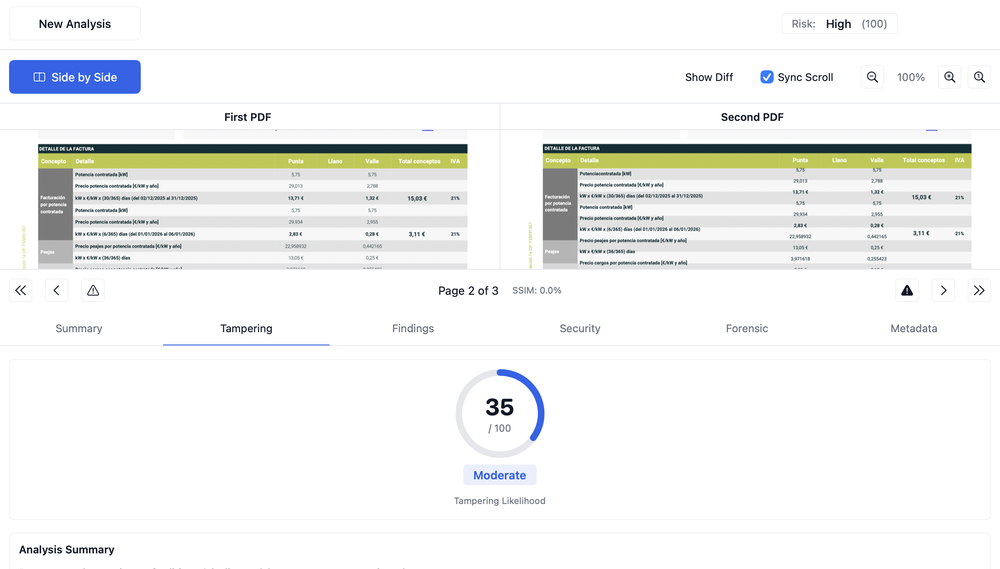
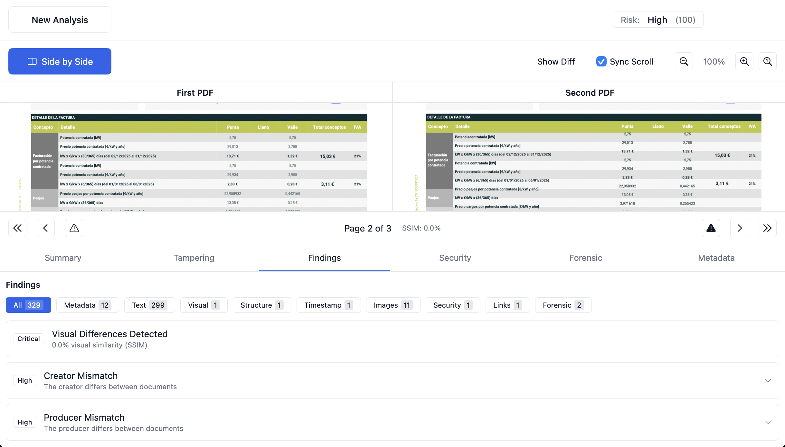
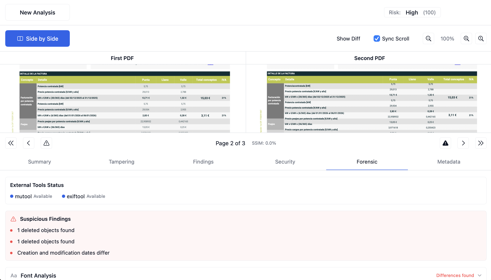
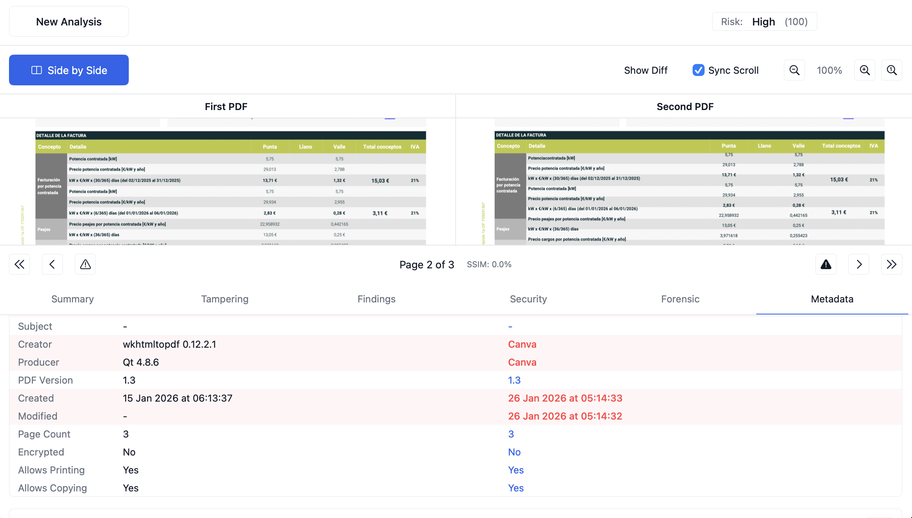

<p align="center">
  
</p>

<h1 align="center">PDFCHK</h1>

<p align="center">
  <strong>PDF Forensic Tool for macOS</strong>
</p>

<p align="center">
  <a href="#features">Features</a> •
  <a href="#installation">Installation</a> •
  <a href="#usage">Usage</a> •
  <a href="#requirements">Requirements</a> •
  <a href="#license">License</a>
</p>

<p align="center">
  
  
  
</p>

---

## About

PDFCHK is a native macOS application for forensic analysis of PDF documents. It helps identify signs of tampering, modification, or forgery by analyzing document structure, metadata, and content.

**Key capabilities:**
- Single PDF analysis for tampering indicators
- Comparative analysis between two PDF versions
- Visual side-by-side comparison with difference highlighting
- Comprehensive forensic reporting

## Features

### Tampering Detection
- **Incremental Updates** — Detect post-creation modifications
- **Deleted Objects** — Find removed content that may be recoverable
- **Date Discrepancies** — Identify timestamp anomalies
- **Signature Validation** — Verify digital signatures and coverage
- **Hidden Content** — Discover invisible elements and layers

### Document Analysis
- **Text Comparison** — LCS-based text diff with similarity scoring
- **Visual Comparison** — SSIM-based image analysis per page
- **Metadata Extraction** — PDF metadata, XMP data, and file system info
- **Font Analysis** — Embedded fonts, subsets, and font chain
- **Structure Analysis** — Internal PDF object structure

### External Tool Integration
- **mutool** — Extended font and object analysis
- **exiftool** — Deep metadata and XMP history extraction

### Forensic Scoring
- Tampering likelihood score (0-100)
- Risk assessment with severity levels
- Detailed indicator breakdown

## Screenshots

<p align="center">
  
</p>

<p align="center">
  
</p>

<p align="center">
  
</p>

<p align="center">
  
</p>

<p align="center">
  
</p>

<p align="center">
  
</p>

## Installation

### Requirements
- macOS 13.0 (Ventura) or later
- Xcode 15+ (for building from source)

### Optional Dependencies
For enhanced forensic analysis, install:
```bash
brew install mupdf-tools  # mutool
brew install exiftool     # exiftool
```

### Build from Source
```bash
git clone https://github.com/micheldegeofroy/PDFCHK.git
cd PDFCHK
swift build -c release
```

### Run
```bash
.build/release/PDFCHK
```

## Usage

### Single PDF Analysis
1. Drop a PDF onto the first drop zone
2. Click **Analyze**
3. Review tampering indicators and forensic findings

### Comparative Analysis
1. Drop the original PDF onto the first drop zone
2. Drop the comparison PDF onto the second drop zone
3. Click **Start Comparative Analysis**
4. Review side-by-side comparison and differences

### Keyboard Shortcuts
| Shortcut | Action |
|----------|--------|
| ⌘N | New Analysis |
| ⌘⇧E | Export as JSON |
| ⌘⌥E | Export as PDF |

## Tampering Indicators

| Indicator | Severity | Description |
|-----------|----------|-------------|
| Invalid Signature | Critical | Digital signature failed validation |
| Improper Redaction | Critical | Redacted content is recoverable |
| Partial Signature | High | Signature doesn't cover entire document |
| Deleted Objects | High | Content was removed but data remains |
| Incremental Updates | Medium | Document modified after creation |
| Date Discrepancy | Medium | Creation/modification dates differ |
| Hidden Content | Medium | Invisible elements detected |
| XMP Edit History | Info | Modification history in metadata |

## Architecture

```
PDFCHK/
├── App/                    # Application entry point
├── Models/                 # Data models
│   ├── TamperingAnalysis   # Tampering detection models
│   ├── DetectionReport     # Forensic report structure
│   └── ...
├── Services/               # Core analysis services
│   ├── TamperingAnalyzer   # Tampering detection engine
│   ├── PDFAnalyzer         # PDF parsing and extraction
│   ├── ImageComparator     # Visual comparison (SSIM)
│   ├── TextComparator      # Text diff (LCS)
│   └── ...
├── ViewModels/             # SwiftUI view models
└── Views/                  # SwiftUI views
```

## Technology

- **Swift 6** with strict concurrency
- **SwiftUI** for native macOS UI
- **PDFKit** for PDF rendering and parsing
- **Accelerate** for SSIM calculation
- **Core Image** for visual diff generation
- **CryptoKit** for SHA-256 checksums

## License

MIT License — see [LICENSE](LICENSE) for details.

---

<p align="center">
  Made with Swift and SwiftUI for macOS
</p>
